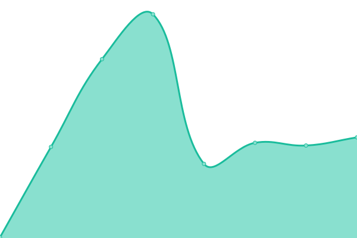
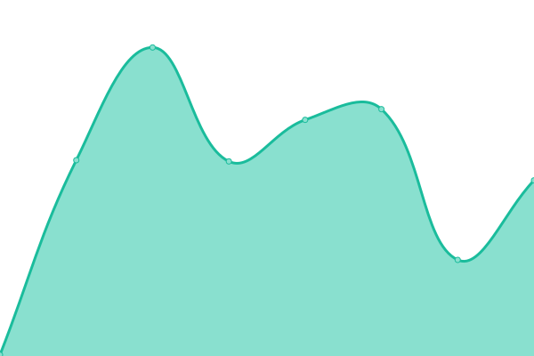
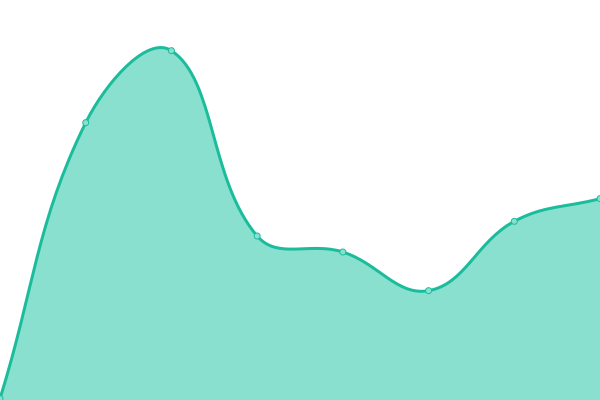

# [📈 Live Status](https://paulkiernan.github.io/paulynomial-uptime): <!--live status--> **🟧 Partial outage**

This repository contains the open-source uptime monitor and status page for [Paul Kiernan](http://paulynomial.com/), powered by [Upptime](https://github.com/upptime/upptime).

With [Upptime](https://upptime.js.org), you can get your own unlimited and free uptime monitor and status page, powered entirely by a GitHub repository. We use [Issues](https://github.com/paulkiernan/paulynomial-uptime/issues) as incident reports, [Actions](https://github.com/paulkiernan/paulynomial-uptime/actions) as uptime monitors, and [Pages](https://paulkiernan.github.io/paulynomial-uptime) for the status page.

<!--start: status pages-->
<!-- This summary is generated by Upptime (https://github.com/upptime/upptime) -->
<!-- Do not edit this manually, your changes will be overwritten -->
<!-- prettier-ignore -->
| URL | Status | History | Response Time | Uptime |
| --- | ------ | ------- | ------------- | ------ |
|  [Paulynomial (index)](https://paulynomial.com) | 🟩 Up | [paulynomial-index.yml](https://github.com/paulkiernan/paulynomial-uptime/commits/HEAD/history/paulynomial-index.yml) | 

 296ms
     
 | 

<a href="https://paulkiernan.github.io/paulynomial-uptime/history/paulynomial-index">53.84%</a>
    

|  [Hack the Gibson](https://gibson.paulynomial.com) | 🟩 Up | [hack-the-gibson.yml](https://github.com/paulkiernan/paulynomial-uptime/commits/HEAD/history/hack-the-gibson.yml) | 

 276ms
     
 | 

<a href="https://paulkiernan.github.io/paulynomial-uptime/history/hack-the-gibson">53.66%</a>
    

|  [Taqueria Bonjour](https://bonjour.paulynomial.com) | 🟩 Up | [taqueria-bonjour.yml](https://github.com/paulkiernan/paulynomial-uptime/commits/HEAD/history/taqueria-bonjour.yml) | 

 171ms
     
 | 

<a href="https://paulkiernan.github.io/paulynomial-uptime/history/taqueria-bonjour">52.70%</a>
    

|  [Paulynomial (index) (www-redirect)](https://www.paulynomial.com) | 🟩 Up | [paulynomial-index-www-redirect.yml](https://github.com/paulkiernan/paulynomial-uptime/commits/HEAD/history/paulynomial-index-www-redirect.yml) | 

 266ms
     
 | 

<a href="https://paulkiernan.github.io/paulynomial-uptime/history/paulynomial-index-www-redirect">53.84%</a>
    

|  [Paulynomial (index) (paulinomial-redirect)](https://paulinomial.com) | 🟥 Down | [paulynomial-index-paulinomial-redirect.yml](https://github.com/paulkiernan/paulynomial-uptime/commits/HEAD/history/paulynomial-index-paulinomial-redirect.yml) | 

 273ms
     
 | 

<a href="https://paulkiernan.github.io/paulynomial-uptime/history/paulynomial-index-paulinomial-redirect">0.00%</a>
    

|  [Paulynomial (index) (www-paulinomial-redirect)](https://www.paulinomial.com) | 🟥 Down | [paulynomial-index-www-paulinomial-redirect.yml](https://github.com/paulkiernan/paulynomial-uptime/commits/HEAD/history/paulynomial-index-www-paulinomial-redirect.yml) | 

 249ms
     
 | 

<a href="https://paulkiernan.github.io/paulynomial-uptime/history/paulynomial-index-www-paulinomial-redirect">0.00%</a>
    

|  [Paulynomial (index) (paul-kiernan-redirect)](https://paul-kiernan.com) | 🟥 Down | [paulynomial-index-paul-kiernan-redirect.yml](https://github.com/paulkiernan/paulynomial-uptime/commits/HEAD/history/paulynomial-index-paul-kiernan-redirect.yml) | 

 250ms
     
 | 

<a href="https://paulkiernan.github.io/paulynomial-uptime/history/paulynomial-index-paul-kiernan-redirect">0.00%</a>
    

|  [Paulynomial (index) (www-paul-kiernan-redirect)](https://www.paul-kiernan.com) | 🟥 Down | [paulynomial-index-www-paul-kiernan-redirect.yml](https://github.com/paulkiernan/paulynomial-uptime/commits/HEAD/history/paulynomial-index-www-paul-kiernan-redirect.yml) | 

 251ms
     
 | 

<a href="https://paulkiernan.github.io/paulynomial-uptime/history/paulynomial-index-www-paul-kiernan-redirect">0.00%</a>
    

<!--end: status pages-->

[**Visit our status website →**](https://paulkiernan.github.io/paulynomial-uptime)

## 📄 License

- Powered by: [Upptime](https://github.com/upptime/upptime)
- Code: [MIT](./LICENSE) © [Paul Kiernan](http://paulynomial.com/)
- Data in the `./history` directory: [Open Database License](https://opendatacommons.org/licenses/odbl/1-0/)
